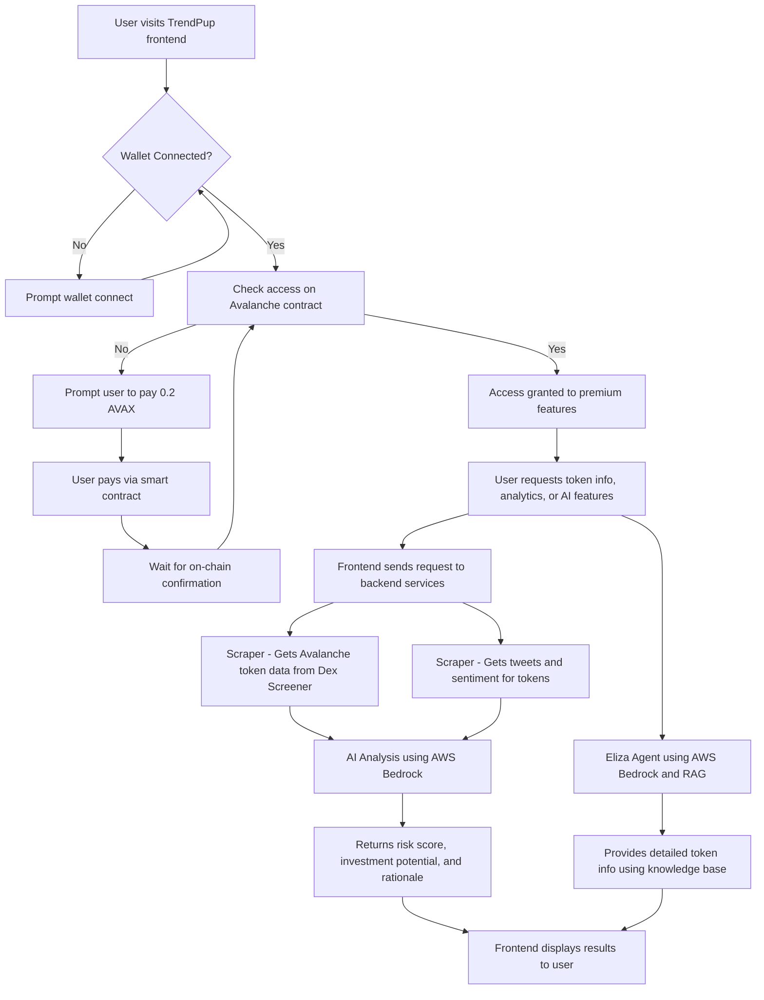

## Problem It Solves

An **AI-powered early detection system** specifically designed for **Avalanche (Avax) Chain meme coins**, identifying **promising tokens before significant price movement**.

Our **profit-sharing business model** aligns incentives perfectly with users - **we only earn when our users profit from our signals**.

## What Users Can Use It For

Our AI-powered system helps users:

- **Discover high-potential Avax meme coins early** - before major price surges, giving retail investors a critical edge.
- **Automate token monitoring** - eliminating the need to manually scan Telegram, Twitter, DEXs, and trackers across multiple platforms.
- **Filter scams and rugpulls** - using behavioral and on-chain analysis to detect red flags, making trading safer.
- **Identify real community momentum** - distinguishing organic growth from paid shills or bot activity.
- **Level the playing field** - by reducing information asymmetry traditionally exploited by insiders, whales, and snipers.
- **Enter earlier for maximum ROI** - ensuring users don't miss the small window of explosive growth most meme coins experience early on.

## How It Improves the Status Quo

Traditional methods of discovering meme coins on the Avax Chain have major flaws:

- Discovering tokens **after** the pump = missed profits  
- **Manual research** wastes time and is error-prone  
- Hard to tell a **genuine project** from a scam  
- **Insiders and bots** always move first  
- Most tools can't separate **real hype from fake**  
- Retail traders often miss the **early-entry sweet spot**

Our system solves all of this — and better yet, **we only profit when you do**.

## TrendPup Project Architecture Flow

**Component Breakdown**

- **Hosting:**  
  All services are hosted on EC2 for reliability and scalability.

- **Frontend (Next.js):**  
  Handles wallet connection, access control, and user interface.  
  Communicates with backend for data and AI features.

- **Scraper:**  
  Scrapes Dex Screener for Avalanche token data.  
  Scrapes Twitter for token-related tweets and sentiment.

- **AI Analysis (AWS Bedrock):**  
  Reads tweets and token data.  
  Determines risk score, investment potential, and provides rationale.

- **Eliza Agent (AWS Bedrock + RAG):**  
  Special AI agent with Retrieval-Augmented Generation.  
  Answers user queries with the latest token data and in-depth analysis.

**Summary:**  
This system ensures only paid users (on Avalanche) can access premium features. The backend aggregates real-time blockchain and social data, then leverages advanced AI (AWS Bedrock) for investment analysis and conversational intelligence, all orchestrated through a modern Next.js frontend.
